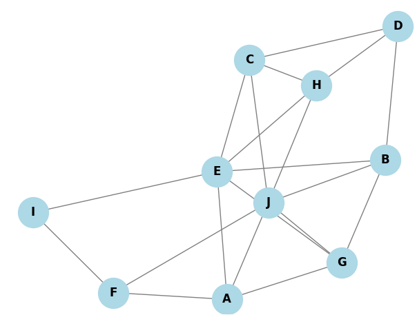

# Random Connected Graph Visualizer
Generate and visualize a connected random graph of n nodes

This Python script generates a connected random graph with a user-defined number of nodes. The nodes are labeled with letters starting from A. 

Example to run: 
```bash
python graph_generator.py 10
```

This will generate a visualization of a random graph consisting of 10 nodes, labeled A, B, C, etc. 

The graph is visualized using the NetworkX and Matplotlib libraries.

Here is an example of the output:



## Requirements

- Python 3.x
- NetworkX
- Matplotlib

To install the required libraries, run the following command:

```bash
pip install networkx matplotlib
```


The Code in this repo has been generated with assistance from GPT-4
